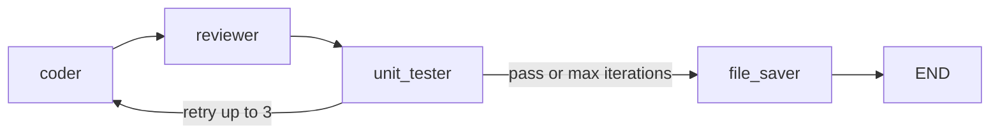

# Universal-Developer

A [LangGraph](https://github.com/langchain-ai/langgraph) workflow that loops between **coding**, **review**, **execution** (Python only), and **saving** output. It calls Anthropic Claude through `langchain-anthropic`.

## Flow



1. **Coder** — Produces or updates code from the user story, prior code, reviewer feedback, and test output.
2. **Reviewer** — If the model reply contains `PASSED` (case-insensitive), feedback is cleared; otherwise feedback is kept for the next coder turn.
3. **Unit tester** — For **Python** only: writes `temp_verify.py`, runs `python3` with a 5s timeout. Other languages skip execution and are treated as passing for this step.
4. **File saver** — Writes `final_script.<ext>` in the project directory.

After the unit tester, the graph goes to **file saver** when `(is_passing and no feedback)` **or** `iterations >= 3`; otherwise it returns to the coder.

## Requirements

- Python **3.14+** (see `pyproject.toml`)
- [uv](https://github.com/astral-sh/uv) recommended
- Environment variable: `ANTHROPIC_API_KEY`

Default model: `claude-sonnet-4-5-20250929` (`nodes.py`).

## Setup

### New project (from scratch)

```bash
uv init
uv venv
uv add langchain langgraph langchain-anthropic
```

`uv init` creates `pyproject.toml`; `uv venv` creates `.venv`; `uv add` records those packages and installs them.

### This repository (already has `pyproject.toml`)

```bash
export ANTHROPIC_API_KEY="your_key_here"
uv sync
```

`uv sync` creates or updates the virtualenv and installs locked dependencies from `pyproject.toml` / `uv.lock` (if present).

## Run

```bash
uv run python main.py
```

You will be prompted for:

- **Language** — `python`, `java`, `rust`, `go`, `node`, or `sql` (see table below)
- **User story / task** — What the agent should implement

## Output filenames

| `language` | Saved as        |
| ---------- | --------------- |
| `python`   | `final_script.py`   |
| `java`     | `final_script.java` |
| `go`       | `final_script.go`   |
| `node`     | `final_script.js`   |
| `rust`     | `final_script.rs`   |
| `sql`      | `final_script.sql`  |
| other      | `final_script.txt`  |

## Project layout

| File | Role |
| ---- | ---- |
| `state.py` | Shared `AgentState` |
| `nodes.py` | LLM nodes, subprocess test, file save |
| `graph.py` | Graph definition and `create_graph()` |
| `main.py` | CLI prompts and `app.invoke()` |
| `pyproject.toml` | Dependencies |

## Security

Generated **Python** is executed on your machine. Only use trusted prompts, or run in an isolated environment for untrusted input.
